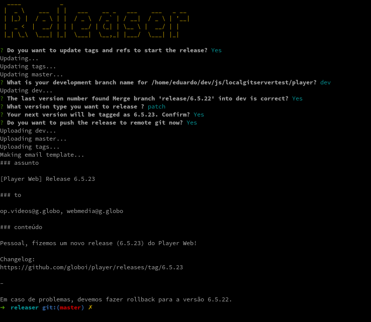

# Releaser
> Its is a simple tool to help deploy NodeJS projects that uses **gitflow**



## Installation

OS X & Linux:

```sh
yarn
```

## Usage example

node index **absolute path of git repository]**

### Example

node index **/$USER/project-path**

## Development setup

To do.

```sh
yarn
```

## Release History

* 0.0.1
  * Template support